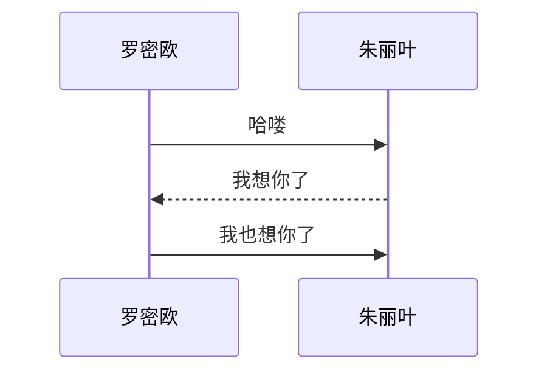

## 说明

尽管基础的markdown语法很简单，但是由于解析器实现的不一致性，尤其是对于扩展的markdown语法的支持程度差异很大，导致我们在使用markdown的时候会出现不同场景的差异性。这篇文章打算以GFM和Typora为主，去介绍一下markdown的语法格式规范以及各个解析器的支持程度。

本文中涉及到的所有的markdown语法我都会尽量注明各种情况是否支持（没有特别指出的时候，默认都支持），同时也会加一些[markdownlint](https://github.com/DavidAnson/markdownlint)的规则描述。

- [GFM](https://github.github.com/gfm/)：GitHub Flavored Markdown，算是最通用的markdown扩展规范了；
- [Typora](https://typora.io/)：个人认为最好的markdown可视化编辑器和查看器，支持`windows`和`mac`，在GFM基础上，它还支持很多额外的markdown扩展；
- [kramdown](https://kramdown.gettalong.org/index.html)：作为`jekyll`的默认markdown解析器，现在应该是github pages默认的markdown解析器；
- `visual studio code`的markdown扩展：可以方便启用`markdownlint`检查，尽管该解析器还存在较多问题，也会关注下其解析效果；

## 基础语法

### 标题

使用`#`字符就可以指定标题，输入1-6个`#`，分别对应1-6级标题。顾名思义，`#`数目越少，标题级别就越高。`#`和标题名之间应该确保包含一个空格，另外标题前后需要存在一行空行。

```markdown
# 一级标题
## 二级标题
### 三级标题
###### 六级标题
```

在生成`html`时，会对应到`<h1>`、`<h2>`、`<h3>`和`<h6>`

```html
<h1>一级标题</h1>
<h2>二级标题</h2>
<h3>三级标题</h3>
<h6>六级标题</h6>
```

### 正文段落

普通文本可以直接输入，需要注意的是普通的换行是不生效的（也有部分markdown解析器会生效），只是方便在编辑器中查看而已。如果要实现换行的话，需要在行尾加上两个空格，或者手动加上`<br/>`标签（不符合markdown lint标准，非必要情况下不要这么操作）。  
我在上面末尾加了两个空格，所以这是新的一行（但不是新的一段）。

如果中间有一行空行的话，则会产生是一个新的段落。换行对应到html的`<br/>`，段落对应到html`<p> </p>`。

行首和行尾的单个空格一般会被忽略，段落之间不要有多行空行。

### 字体样式

字体样式|语法|例子|html
---|---|---|---
粗体(Bold)|`** **` 或`__ __`|**这是粗体**|`<strong></strong>`
斜体(Italic)|`* *` 或`_ _`|*这是斜体*|`<em></em>`
粗斜体(Bold and Italic)|`*** ***` 或`___ ___`|***这是粗斜体***|`<strong><em></em></strong>`
删除线(Strikethrough)|`~~ ~~`|~~这是删除线~~|`<del></del>`

删除线不属于标准的markdown规范，但是一般的解析器都会支持。至于使用\*还是使用\_则看个人习惯，使用\*的人更多一些。

### 引用

使用`>`即可进行引用，对应html的`<blockquote></blockquote>`，如果引用需要分多段的的话，可以在中间加一个仅包含`>`的一行即可。如果中间是一个空行的情况，大部分解析器会将其认为是2个引用块，也有部分会将其认为是1个引用块，使用中最好尽量避免中间有空行的情况出现。

李白曾经写过

> 君不见，黄河之水天上来，奔流到海不复回。君不见，高堂明镜悲白发，朝如青丝暮成雪。
>
> 人生得意须尽欢，莫使金樽空对月。天生我材必有用，千金散尽还复来。

### 列表

使用`*`、`-`或`+`产生无序列表，使用数字加`.`产生有序列表，有序列表的数字不一定需要有序，但是需要从1开始，也可以所有都是1。

无序列表：

- Java
- C/C++
- Python

有序列表：

1. Java
2. C/C++
3. Python
4. Go
5. PHP

无序列表产生的html如下`<ul><li></li><li></li></ul>`，有序列表产生的html如下`<ol><li></li><li></li></ol>`

对于多级列表，需要确保子列表与上一级列表的内容对齐，对于有序列表的二级列表缩进3个空格（数字+`.`+空格），对于无序列表的二级列表缩进2个空格（`-`+空格）。对于list内部包含段落、引用、代码块、表格等情况，建议和上述规则保持一致。对于上述情况在二级列表或者段落前后包含一个空行。

不同的markdown解析器对于列表内包含段落的情况处理的并不一致，所以存在着各种写法，比如段落前用4个空格、在上一行末尾加入2个空格（软换行）等等，建议保持标准的写法兼容尽量多的解析器。

```markdown
1. Java

   Java连续霸榜TIBOE编程语言排行榜，已然成为业界最受欢迎的变成语言。

2. C/C++

   - C
   - C++

3. Python
4. PHP

   > 曾经有人说PHP是世界上最好的语言

   LAMP曾经是标配，如今已经不再那么流行……
```

1. Java

   Java连续霸榜TIBOE编程语言排行榜，已然成为业界最受欢迎的变成语言。

2. C/C++

   - C
   - C++

3. Python
4. PHP

   > 曾经有人说PHP是世界上最好的语言

   LAMP曾经是标配，如今已经不再那么流行……

### 链接

链接写法 `[展现名](链接地址 "标题")`，比如[腾讯网](https://www.qq.com)，其中的`"标题"`可以省略，链接地址可以使用绝对路径也可以使用相对路径，或者指向本地/本网站的其他文件。更进一步，也可以指向本文件的其他锚点（书签），比如[跳转引用](#引用)。

展现的名字和链接地址一致的时候会显得有些冗余，比如`[https://www.qq.com](https://www.qq.com)`，有更简洁的写法，直接用`<https://www.qq.com>`生成<https://www.qq.com>。

如果多处需要链接相同的地址，我们也可以采用引用的方式，使用`[展现名][链接名]`，然后在任意地方定义链接名的具体地址 `[链接名]: 链接地址`，比如[腾讯][qq]，这样子还有个好处是方便管理。

[qq]: https://www.qq.com "腾讯网"

### 图片

和链接的语法类似，图片需要在前面加上`!`，常见的写法`![展现名][图片地址]`，如果需要图片本身也是链接的话，在外层加上链接地址：`[![展现名][图片地址]](链接地址)`

[](https://www.qq.com)

### 表格

表格不是标准的markdown，但是常见的解析器会支持，写法如下，完整的情况会在第一列前面和最后列后面加上`|`，表头和内容中间需要一行分隔符，这里建议保持和列数一致，某些解析器也会支持最简单的写法`---|---`（不管多少列的情况下），但是很多解析器并不支持，这里可以通过`:`来指定表格的对齐方向，左对齐、右对齐还是居中。

```html
表头1|表头2|表头3
:---|:---:|---:
内容|内容|内容
内容|内容|内容
```

国家|面积|人口
:---|:---:|---:
中国|960万平方公里|14亿
美国|936万平方公里|3亿
俄罗斯|1709万平方公里|1.4亿

### 分隔符

使用`---`或者`***`作为分隔符

---

### 转义字符

由于一些符号在markdown中有了特殊含义，比如我们就是要输入`*abc*`，并不希望出现斜体的abc，那么可以使用`\`作为转衣符，输入`\*abc\*`，结果为\*abc\*。

## 扩展语法

### 代码

行内使用\`作为起始和终止符，比如`printf`，代码块使用位于独立行的```作为起始和终止

```cpp
int main(int argc, char *argv[])
    cout << "hello world!" << endl;
    return 0;
}
```

### 任务列表

任务列表（Task List）在github中使用非常广泛，语法格式如下，使用`x`标识为已完成，未完成的情况中间需要包含空格。

```markdown
- [x] 银行存款超过1000万
- [ ] 当上总经理
- [ ] 赢取白富美
```

- [x] 银行存款超过1000万
- [ ] 当上总经理
- [ ] 赢取白富美

### 数学公式

数学公式块，使用位于独立行的`$$`作为起始和终止，比如：

```markdown
$$
f(x)=\sum^{\infty}_{n=0}\frac{f^{(n)}(a)}{n!}(x-a)^n
$$
```

$$
f(x)=\sum^{\infty}_{n=0}\frac{f^{(n)}(a)}{n!}(x-a)^n
$$

行内数学公式，直接使用`$`作为起始和终止：$\delta=b^2-4ac$（有些解析器需要使用`$$`作为起始和终止）。

### html标签

可以使用html标签实现markdown不支持的功能，正常情况下尽量避免使用html标签。

1. 在表格内部需要换行的时候，可以加上`<br/>`标签；
2. 需要指定样式的时候，可以加上类似`<span style="color:red"> </span>`标签，比如：<span style="color:red">我是红色</span>；
3. 指定下划线，使用`<u> </u>`，比如：<u>我是下划线</u>；

### 非通用语法

### 内容目录

使用`[TOC]`生成自动目录。Typora支持该语法，GFM不支持该语法。

### 时序图

使用[js-sequence](https://bramp.github.io/js-sequence-diagrams/)渲染

```sequence
罗密欧->朱丽叶: 哈喽
朱丽叶-->罗密欧: 我想你了
罗密欧->>朱丽叶: 我也想你了
```


gfm不支持时序图，Typora支持。

### 流程图

使用[flowchart.js](http://flowchart.js.org/)渲染

```flow
st=>start: 开始
cond=>condition: 有房有车
op1=>operation: 赢取白富美
op2=>operation: 走向人生巅峰
e=>end: 结束

st->cond
cond(yes)->op1->op2->e
cond(no)->e
```


gfm不支持流程图，Typora支持。

### mermaid图

[`mermaid`](https://mermaidjs.github.io/)相比时序图和流程图来说，功能会更强大，支持时序图、流程图、UML图、状态图、甘特图等，Typora支持但是GFM不支持。目前来看，使用算是比较广泛了。官网提供了较丰富的例子，[Mermaid Live Editor](https://mermaidjs.github.io/mermaid-live-editor/)提供了在线编辑以及导出SVG。

看下用`mermaid`来画时序图的例子：




### 脚标和上下标

可以使用语法​`[^脚标A]: 这是脚标A`来创建角标（需要使用代码块模式），在需要引用的地方使用`[^脚标A]`进行引用[^脚标A]。Typora支持该语法，GFM不支持该语法。

[^脚标A]: 这是脚标A

上标和下标没有一致的标准，在Typora中使用`^文字^`表示上标，使用`~文字~`表示下标，但我看并没有得到广泛支持。建议在markdown中尽量避免使用上下标，如果要保持兼容性的话采用HTML的`<sup>文字</sup>`展示上标，使用`<sub>文字</sub>`的方式展示下标。

### YAML头信息

在文件的头部使用使用独立行的`---`作为开始和终止，其中间部分会作为metadata，并不会生成可视内容，这本来是[jekyll](https://jekyllrb.com/docs/front-matter/)的特殊格式，现在Typora也支持该语法（尽管不一定会生成html里面的metadata）。

### Github emoji

按文本形式输入类似`:smile:`，常见的可以直接输入，完整的可以参考[列表](https://gist.github.com/rxaviers/7360908)。Typora和github都支持，vscode的相关插件不支持。

- 人：:boy::girl::man::woman::baby::older_woman::older_man::princess::cop::angel::couple::walking::runner::dancers:
- 动物：:cat::dog::pig::frog::cow::horse::snake::bird::mouse::wolf::monkey::camel:
- 表情：:smile::cry::confused::sob::joy::mask::worried::wink::relaxed::grin::kissing::open_mouth::heart_eyes:

## 参考资料

1. [Writing on GitHub/Basic writing and formatting syntax](https://help.github.com/articles/basic-writing-and-formatting-syntax/)
2. [GitHub Flavored Markdown Spec](https://github.github.com/gfm/)
3. [Markdown Guide](https://www.markdownguide.org/)
4. [Markdown Tutorial](https://commonmark.org/help/)
