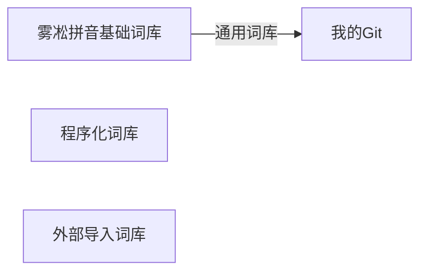

[TOC]

## 初见“仓输入法”

我在windows和mac使用了Rime输入法已经有一段时间了，但是手机上之前看[iRime](https://apps.apple.com/cn/app/id1142623977)不太完善也不经常更新，当然自己也懒得折腾，iOS系统关闭了网络权限，至少隐私上是有保障的。直到最近接触到[仓输入法](https://apps.apple.com/cn/app/id6446617683)，发现功能已经做得很完善了。不仅内置了雾凇拼音等优秀的输入方案，而且对数据同步、词表更新也提供了比较完善的解决方案。立马下定决心完成最后一环，实现全平台输入法RIME统一化。

## 上手“仓输入法”

如果不考虑跨平台的同步，不想研究配置的具体含义，仓输入法可以算是新手友好度很高了，当然这是相比鼠须管和小狼毫而言。我想无缝迁移我的电脑端的配置，所以保留使用26键是最方便的，否则又得花时间熟悉9键的配置了。从Nokia时代开始就习惯了的T9输入法，我能做到很高的单手盲打速度，似乎要开始转变了。我很喜欢这个上下左右划动的设定，这样几乎就能有上百项单键输入内容了。我们可以很方便在一个26键字母键盘上加上数字，及大量的标点符号。快捷输入（手机号、邮箱地址、车牌号等等）真的很方便，尽管v模式也挺好，但毕竟要打好几个字，而这个下划真的就是那么一下就搞定。此外，我们还可以增加很多系统命令，复制、粘贴、剪切等，以及输入法的方案切换等等。

键盘配置这块官方的文档不算特别详细，要注意区分字符（symbols）和符号（character），只有符号才支持Rime处理。另外也得勾选【经过Rime处理】。

除了键盘配置之外，其他的配置和PC端是完全一致的，基本上可以直接复用PC端配置。将PC端配置打包发到手机后，导入到仓输入法基本就能生效了。

## 形码输入

看群里还蛮多人钟情于五笔86的人，想起自己也算是最早一代使用五笔的人，直到后面拼音输入法联想的完善，在常用语的打字速度上五笔已经处于劣势了。想起来有8年以上没有使用过五笔输入了，这似乎有点遗憾。那么不做为

词库管理

