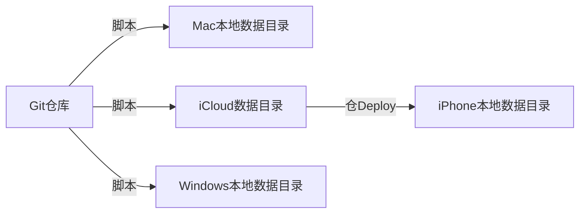
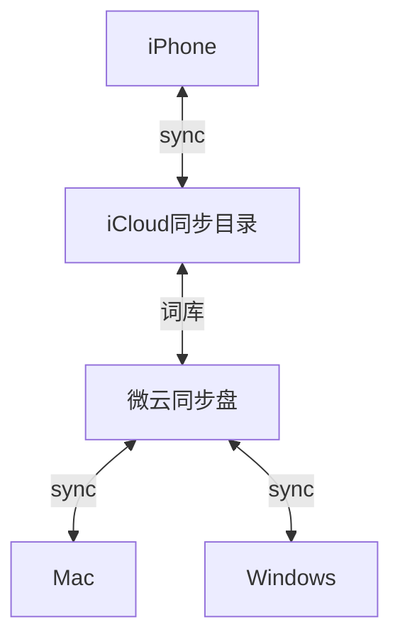

<!--more-->

## 初见“仓输入法”

在 windows 和 mac 使用了 Rime 输入法已经有一段时间了，但是手机上的[iRime](https://apps.apple.com/cn/app/id1142623977)并不完善，更新也不频繁。iOS 系统关闭了网络权限，在输入法隐私上这点是有保障的。直到最近接触到[仓输入法](https://apps.apple.com/cn/app/id6446617683)，发现功能已经做得很完善了。它不仅内置了雾凇拼音等优秀输入方案，还提供了数据同步和词表更新的完善解决方案。这促使我下定决心，完成全平台输入法 RIME 统一化的最后一环。

## 上手“仓输入法”

对于不想深入研究配置细节的用户，仓输入法的新手友好度相当高。我选择保留 26 键布局，以无缝迁移电脑端配置，避免重新适应 9 键布局。习惯了从 Nokia 时代的 T9 输入法，我能够实现高速单手盲打，但现在是时候转变了。仓输入法的上下左右划动设定，极大地扩展了单键输入内容的可能性，使得快捷输入变得异常方便。。我们可以很方便在一个 26 键字母键盘上加上数字，及大量的标点符号。快捷输入（手机号、邮箱地址、车牌号等等）真的很方便，相比起电脑上之前的 v 模式，这个下划真的就是那么一下就搞定了。此外，我们还可以增加很多系统命令，复制、粘贴、剪切等，以及输入法的方案切换等等。

键盘配置方面，官方文档尚需完善。注意区分字符（symbols）和符号（characters），只有符号才支持 Rime 处理。此外，确保勾选了“经过 Rime 处理”选项。 

除了键盘配置之外，其他的配置和 PC 端是完全一致的，基本上可以直接复用 PC 端配置。将 PC 端配置打包发到手机后，导入到仓输入法基本就能生效了。

## 想念“五笔输入”

看群里还蛮多人钟情于五笔 86 的人，想起自己也算是最早一代使用五笔的人，直到后面拼音输入法联想功能的完善，尤其在引入在线提示词之后，常用语的打字速度上五笔已经处于劣势了，我才逐步切换到了搜狗拼音输入法。

这么想起来有 8 年没有使用过五笔输入了，这似乎是有点遗憾。 我开始折腾起五笔输入法了，先拿五笔做了反差来用吧。首先想要找一份简体的五笔单字码表，有人推荐了[WubiLex](https://github.com/aardio/wubi-lex)，还是相当好用的，自带大量的五笔词库。开始选择了微软五笔的单字，后面发现很多字都不支持，比如羴之类的。既然要作为反查词库，那么词库必须完整啊。后面用了 WubiLex 自带的五笔单字库，字库看起来还是比较完整的。现在五笔可以作为不认识字的反查，也可以想念的时候切换打打字。原以为五笔打字是刻在骨子里面的，不过竟然有点忘记最后一笔的规则了，看来时间还真是会让人忘却。

## 再聊聊“双拼输入”

在研究五笔输入法的时候，同时也看看其他的形码输入法，目前比较多人推崇的是小鹤音形，不过现在对新的形码输入并没有啥兴趣了。不过在过程中看到有人在说，“双拼输入法是投入性价比最高的输入法了，花上几个小时就能熟悉，花上几天就能赶上原来的拼音输入速度了，而且是一辈子受益的”。理论上，双拼能显著降低击键次数和输入错误率。我是否应该花时间学习双拼输入呢？。推荐下这篇文章[让双拼不再是只属于少数人的输入方式](https://sspai.com/post/42667)。

双拼方案众多，主要区别在于是否使用`;`键。搜狗和微软双拼用了`;`做`ing`的输入，而自然码和小鹤并没有去用`;`。我更喜欢后者，小鹤算是在自然码上做了一些改进，尽管这个改进有很多作者自己的因素在里面。花了十几分钟去做打字练习，发现完全没有记住，不过我下载了一张键位图放在桌面了，以后还是会试一试的。顺便推荐一个这个[双拼在线练习](https://api.ihint.me/shuang/)的网站，提供了各种不同的双拼方案的在线练习，另外还有提供小程序。

另我还发现了[双拼方案评测](https://macroxue.github.io/shuangpin/eval.html)工具，它根据击键手指、位置和过程预估打字时间，评估分数，并提供优化方案。理论上，我们可以根据数据设计出最高效的双拼输入法。 

在对不同双拼方案进行比较后，发现主流方案之间的差异不大，从 114.9 到 123.6，差异在 10%不到，简单看数据，相比全拼输入法大概能有 20%-30%的速度提升吧。但是“飞猫”和“乱序”从分数上看却是遥遥领先，这是为啥呢？

| 双拼方案 | 分数  |
| -------- | ----- |
| 拼音加加 | 123.6 |
| 国标双拼 | 119.9 |
| 小鹤双拼 | 118.8 |
| 微软     | 117.9 |
| 自然码   | 116.6 |
| 紫光     | 126.5 |
| 智能 ABC | 114.9 |
| 大牛     | 131   |
| 飞猫     | 174.5 |
| 全拼     | 93.3  |
| 乱序优化 | 182.2 |

我们先来看下“飞猫”和“乱序优化”的键位图。有没有发现和其他双拼输入法很明显的差异，他们的声母是乱序的，你不仅需要记住韵母，还得重新去记声母。通过这一点，能比其他双拼输入法的输入速度再继续提升 30%。而“飞猫”还有一个特点在于部分拼音是支持多个键的，就是所谓的“飞键”，比如`sh`既可以通过`N`也可以通过`A`进行输入，你哪个手指方便就用哪个手指去打印，有点像是按`Shift`键的感觉，你左手打字母那就右手按右边的`Shift`，反之亦然。不过我估计挺多人没有遵守这个基础打字规范，我个人大部分情况还是遵循了这一点的。

网上关于“飞猫”的资料相当少，[这一篇](https://tieba.baidu.com/p/4676554242?pn=1)算是作者在 2016 年发的原文，的确是通过程序计算出来的按键，可是后面就没啥新内容了。GitHub 上也没有其他资料，只有[这一篇](https://github.com/zebats/flying-cat-rime?tab=readme-ov-file)写到在 Rime 中的飞猫配置。下面这些是作者文章中的截图。

## 多端数据同步方案

我们需要同步的数据，可以分为几类：

1. 配置类 yaml 文件；
2. 词库类 yaml 文件；
3. 用户输入词库，以 userdb 格式保存；

我们先看前两类数据的同步方案，这里的数据源头是维护在 Git 仓库的。

在看用户词库的同步方案，这里的数据源头的话就是各个输入设备的本地数据，执行同步操作后会将自己设备的数据写入微云同步盘的指定目录，同时读取其他设备的用户词库进行合并处理。

这里相关的脚本操作在 Mac 和 Windows 上是在 uTools 的快捷命令插件中进行维护，开启了定时执行，手机端是通过 iPhone 的快捷指令进行定时执行。而源头的词库是通过 Github Workflow 进行定时更新的，这样整体流程都不需要人工干预了。
